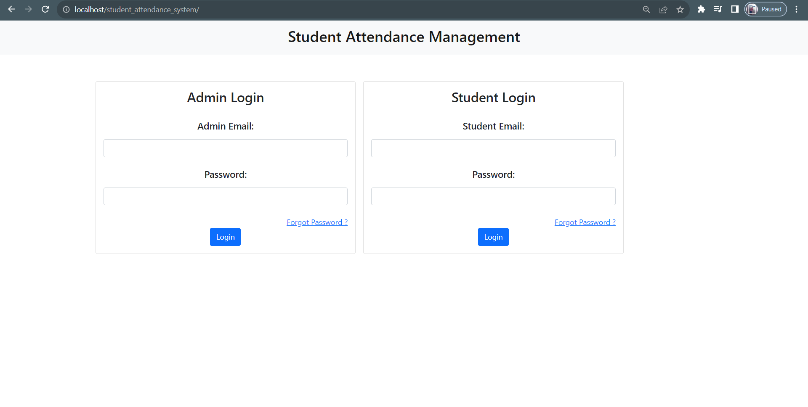
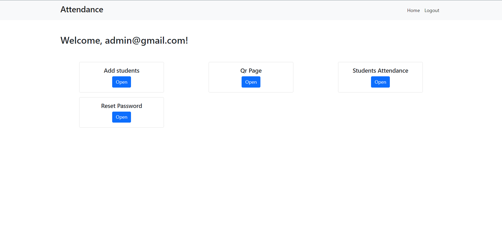
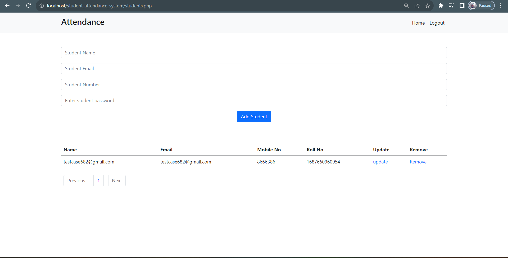
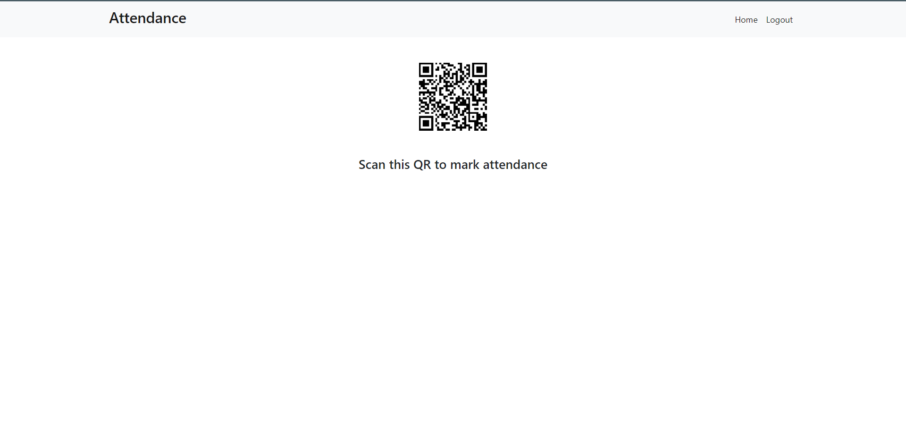
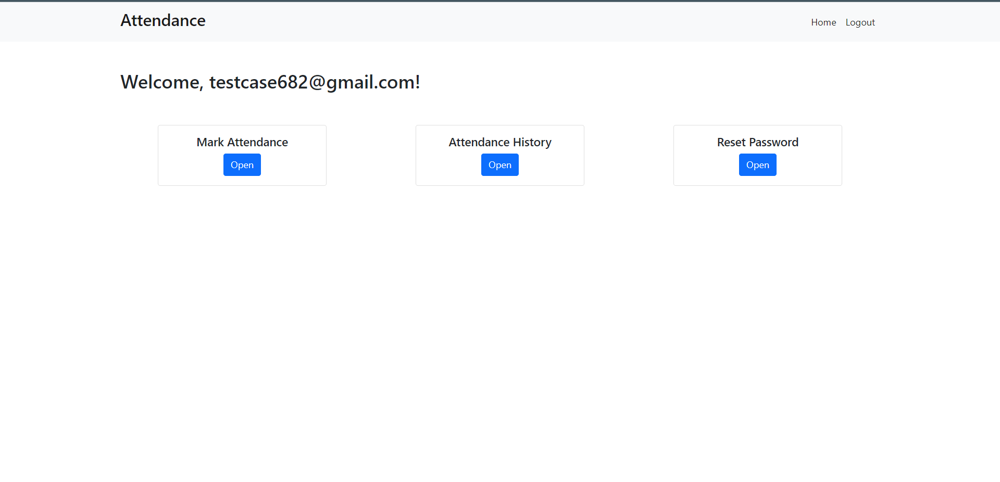
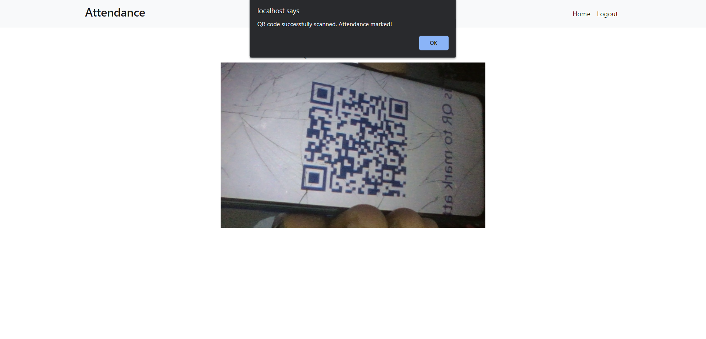
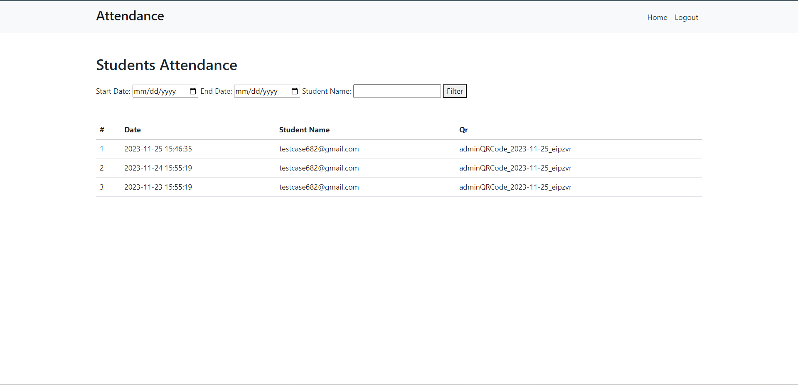
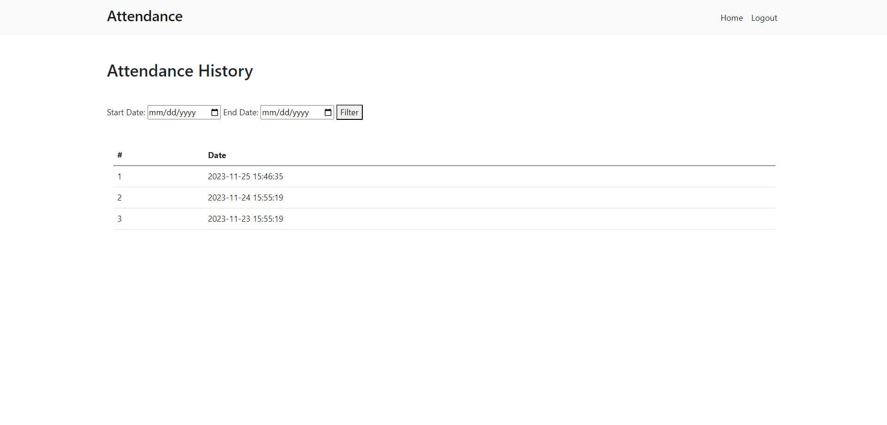

# Student Attendance System Website
This project simplifies attendance tracking by allowing students to mark their attendance through QR code scanning. 

## Project Overview

Live project link  - https://attendease.000webhostapp.com/
If you have to access project you can use credentials -

  username - testcase682@gmail.com
  Password - Pass@123

This project simplifies attendance tracking by allowing students to mark their attendance through QR code scanning. The system ensures swift and accurate attendance recording for effective monitoring.

## Modules

- **Admin Module:**
  - Add Students
  - Generate QR Codes
  - View Student Attendance History

- **Student Module:**
  - Scanner for QR Code
  - View Attendance History

# How to run this project in your machine

1. Install XAMPP on your system.
2. Download the project source file and save it into the `xampp/htdocs` folder.
3. Open XAMPP and start Apache and MySQL.
4. Type `localhost/phpmyadmin` in your preferred browser (e.g., Chrome, Edge, Firefox).
5. Create a database named `student_attendance_system`.
6. Import the .sql file into your database.
7. Type `http://localhost/student_attendance_system/index.html` in your browser, and the project will run.
8. For sending mail from localhost, refer to this [video tutorial](https://www.youtube.com/watch?v=4TmD4ly7V_E&t=142s).

# Project Images

1. Authentication

2. Admin Dashboard

3. Add Students

4. QR Code Page

5. Student Dashboard

6. QR Scanned and attenadnce marked

7. All Students Attendance History

8. Student Attendance History

